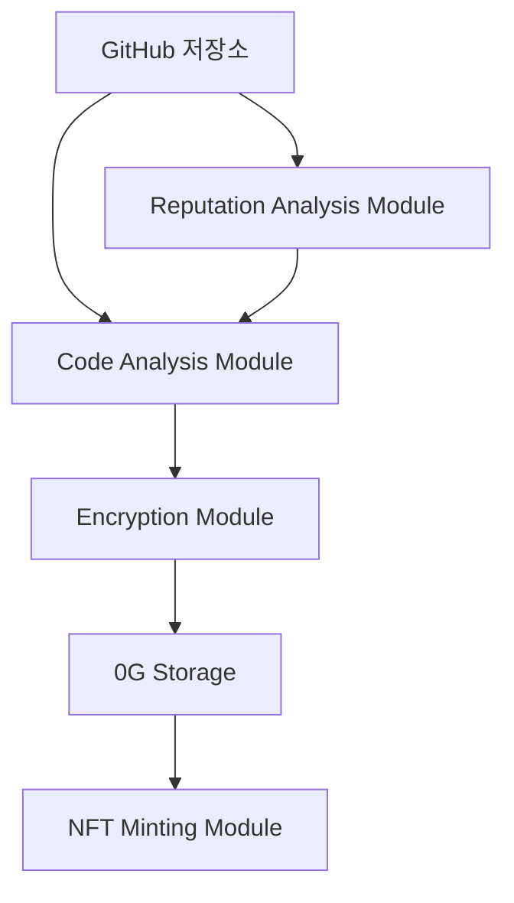

# 아키텍처 문서

## 개요
MCS Agent는 모듈식 코드 보안 플랫폼으로, GitHub 저장소의 코드를 분석하고 보안을 강화하는 시스템입니다.

## 시스템 구성

## 모듈 설명

### Code Analysis Module
- GitHub 저장소 클론
- 코드 분석 및 취약점 식별
- 분석 리포트 생성

### Encryption Module
- AES-256 암호화 구현
- 키 관리
- 메타데이터 생성

### 0G Storage
- 암호화된 코드 저장
- 메타데이터 관리
- 접근 권한 제어

### TEE Proof Generation
- 보안 검증 수행
- 증명 생성

### NFT Minting Module
- 컨트랙트 상호작용
- 트랜잭션 처리
- 이벤트 모니터링

### Reputation Analysis Module
- GitHub 저장소 메트릭 분석
- 신뢰도 점수 계산
- 저장소 평판 평가

## 데이터 흐름
1. GitHub 저장소 URL 입력
2. 평판 분석 모듈이 저장소 메트릭 분석
3. 코드 분석 모듈이 저장소 클론 및 분석
4. 암호화 모듈이 코드 암호화
5. 0G Storage에 암호화된 코드 업로드
6. TEE 증명 생성
7. NFT 민팅

## 보안 고려사항
- 암호화: AES-256 사용
- 저장소: 0G Storage 활용
- 블록체인: 0G Chain 사용
- 평판 분석: GitHub API 활용 